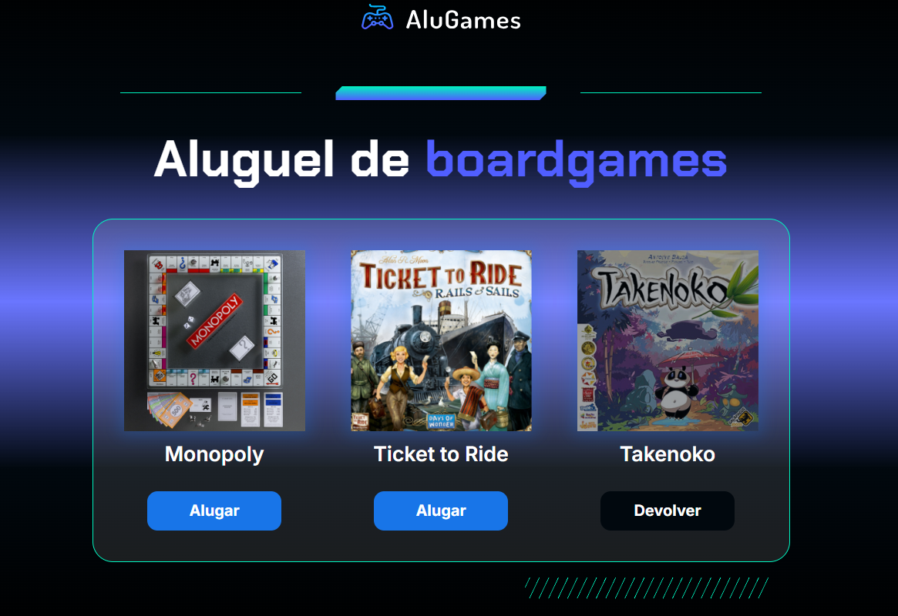

# 🕹️ Alura Games – Lógica de Programação

Projeto desenvolvido durante o curso de **Lógica de Programação** da [Alura](https://www.alura.com.br/), com o tema **Alura Games**.

## 🎯 Objetivo

O objetivo do projeto foi aplicar os conceitos fundamentais de lógica de programação usando **JavaScript**, manipulando elementos de uma interface de catálogo de jogos.

## 🚀 Funcionalidades

- Recuperar elementos da página usando `document.querySelector()` e `getElementById()`
- Manipular classes CSS com `classList.add()`, `remove()` e `contains()`
- Alterar o conteúdo da página com `textContent`
- Controlar o status de aluguel/devolução dos jogos com `if/else`

## 💡 Aprendizados

Durante o desenvolvimento, exercitei os seguintes conceitos:

- Estrutura e análise de código HTML
- Declaração e uso de variáveis no JavaScript
- Manipulação da DOM (Document Object Model)
- Estrutura condicional `if/else`
- Interatividade entre HTML, CSS e JavaScript

## 📷 Demonstração

## 🛠️ Tecnologias utilizadas

- HTML
- CSS
- JavaScript

## 📁 Acesso ao projeto

Você pode acessar o projeto:

- [Repositório no GitHub](https://github.com/marianaprodrigues/alugames.git)

---

Feito com 💙 durante o curso da Alura.
